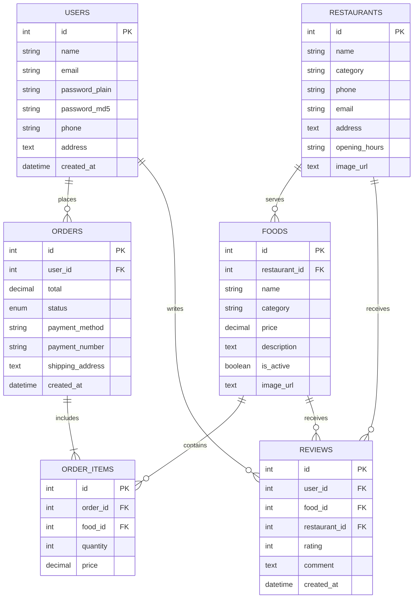

<div align="center">

  <br />
  <h1 align="center">🍔 GourmetHub</h1>
  <h3 align="center">Next-Gen Restaurant Management & Food Ordering System</h3>

  <p align="center">
    A premium, full-stack PHP & MySQL web application powered by <b>Tailwind CSS</b> and <b>DaisyUI 4</b>.
    <br />
    <a href="#-quick-start--xampp-setup"><strong>Explore Setup Guide »</strong></a>
    <br />
    <br />
    <a href="#-key-features">Key Features</a>
    ·
    <a href="#-tech-stack">Tech Stack</a>
    ·
    <a href="#-database-schema">Database Schema</a>
    ·
    <a href="#-credentials">Default Logins</a>
  </p>

  <p align="center">
    
    
    
    
    
  </p>

  <br />
</div>

---

## 📖 Overview

**GourmetHub** is a state-of-the-art **Restaurant Management System and Online Food Delivery Platform**. Designed with modern UX principles, glassmorphism, responsive grid layouts, interactive modal popups, and multi-theme support, GourmetHub provides an effortless ordering experience for customers and comprehensive control tools for restaurant managers.

---

## 🌟 Key Features

### 🛍️ Customer Front-End Experience
* 🎨 **DaisyUI Design System & Modals**: Built using modern typography, glassmorphism, responsive cards, and `<dialog>` modal popups for quick dish previewing, cart confirmations, and reviews.
* 🎭 **Multi-Theme Switcher**: Instant theme toggling saved in `localStorage` supporting **Emerald** (Default), **Light**, **Dark**, **Cupcake**, **Synthwave**, **Cyberpunk**, and **Retro**.
* 🍕 **Dynamic Category Filters**: Filter dishes & restaurants by *Fast Food, Italian, Indian, Asian, Pizza, Desserts, and Beverages*.
* ⭐ **Star Ratings & Customer Reviews**: 1–5 star rating system for dishes and partner restaurants with aggregate star badges.
* 🚚 **Live Order Progress Steps**: Visual step timeline (`Order Placed ➔ Preparing ➔ Out for Delivery ➔ Delivered`).
* 💳 **Multi-Payment Gateway Options**: Integrated payment options for Cash on Delivery, bKash, Nagad, Rocket, and Credit/Debit Cards.
* 🔄 **1-Click Re-Order**: Reload items from previous orders directly into the shopping cart from the customer dashboard.
* 👤 **User Account & Address Management**: Profile management page to edit delivery addresses and update passwords.

### 🛡️ Admin Control Panel
* 📊 **Analytics Dashboard**: Real-time revenue metrics (`SUM(total)`), status breakdown counts, user metrics, and menu item stats.
* ⚡ **1-Click Order Processing**: Transition order states instantly (`Pending ➔ Preparing ➔ Out for Delivery ➔ Delivered / Cancelled`).
* 🍔 **Dish & Menu Management**: Add, edit, toggle availability (`is_active`), and filter dishes with real-time AJAX search.
* 🏬 **Restaurant Partner Management**: Manage restaurant details, cuisine categories, operating hours, and cover photos.
* 👥 **User Account Control**: Manage registered customer profiles and reset user passwords securely.

---

## 🛠️ Tech Stack

```text
├── Backend        : PHP 8.x (OOP & Procedural with Prepared SQL Statements)
├── Database       : MySQL / MariaDB (XAMPP / phpMyAdmin Compatible)
├── Frontend CSS   : Tailwind CSS 3.x + DaisyUI 4.x UI Component System
├── Icons & Fonts  : FontAwesome 6 Pro Icons, Google Fonts (Outfit & Inter)
└── Scripting      : ES6+ JavaScript, jQuery 3.7 (AJAX Filtering)
```

---

## ⚡ Quick Start & XAMPP Setup

### 1. Prerequisites
Ensure you have **XAMPP** (or WAMP / MAMP) installed with **PHP >= 7.4/8.x** and **MySQL**.

### 2. Clone / Copy Repository
Clone or copy the project into your local XAMPP `htdocs` directory:
```bash
git clone https://github.com/puc-void/Restaurant-Management-System.git
```
Path: `C:\xampp\htdocs\Restaurant-Management-System\` (Windows) or `/opt/lampp/htdocs/Restaurant-Management-System/` (Linux).

### 3. Database Import via phpMyAdmin
1. Launch **XAMPP Control Panel** and start **Apache** & **MySQL**.
2. Open your browser and navigate to [http://localhost/phpmyadmin](http://localhost/phpmyadmin).
3. Click the **Import** tab on top.
4. Click **Choose File** and select `database.sql` located at the root of the workspace.
5. Click **Import**. The database `online_food` will automatically be created and seeded.

### 4. Launch the Web Application
* 🌐 **Customer Front-End**: [http://localhost/Restaurant-Management-System/](http://localhost/Restaurant-Management-System/)
* 🔐 **Admin Control Panel**: [http://localhost/Restaurant-Management-System/admin/](http://localhost/Restaurant-Management-System/admin/)

---

## 🔑 Default Login Credentials

### 🛡️ Administrator Account
| Portal | Email | Password |
| :--- | :--- | :--- |
| **Admin Panel** (`/admin/login.php`) | `admin@restaurant.com` | `admin123` |

### 👤 Customer Test Accounts
| Portal | Email | Password |
| :--- | :--- | :--- |
| **Customer Portal** (`/login.php`) | `john@example.com` | `password123` |
| **Customer Portal** (`/login.php`) | `jane@example.com` | `password123` |

---

## 🗂️ Project Architecture & Directory Structure

```text
Restaurant-Management-System/
│
├── 📂 admin/                     # Admin Portal Subsystem
│   ├── add_food.php              # Create new menu item
│   ├── add_restaurant.php        # Register new restaurant
│   ├── dashboard.php             # Analytics & revenue dashboard
│   ├── edit_food.php             # Edit menu item & pricing
│   ├── edit_restaurant.php       # Edit restaurant details
│   ├── edit_user.php             # Edit customer account
│   ├── footer.php                # Admin drawer footer layout
│   ├── header.php                # Admin sidebar drawer layout
│   ├── login.php                 # Admin authentication portal
│   ├── manage_foods.php          # Dish management table with AJAX
│   ├── manage_orders.php         # Customer orders management table
│   ├── manage_restaurants.php    # Restaurant partners table
│   ├── manage_users.php          # Registered users table
│   └── order_details.php         # Order progression & status modal
│
├── 📂 assets/                    # Client Assets
│   └── js/                       # Custom JavaScript scripts
│
├── 📂 includes/                  # Core Shared Engine
│   ├── config.php                # Database connection & session bootstrap
│   ├── footer.php                # Front-end DaisyUI footer & theme engine
│   ├── functions.php             # Shared utility functions (Ratings, Cart, Total)
│   └── header.php                # Front-end DaisyUI navigation & cart drawer
│
├── cart.php                      # Shopping cart page with DaisyUI modals
├── checkout.php                  # Checkout page with multi-payment gateways
├── create_admin.php              # Initial admin account setup script
├── dashboard.php                 # Customer dashboard & order history
├── database.sql                  # XAMPP database dump file with seed data
├── dish.php                      # Dish details & review modal page
├── index.php                     # Hero banner, category pills & dish cards
├── login.php                     # Customer login authentication
├── logout.php                    # Session termination script
├── order_details.php             # Live order tracking timeline page
├── profile.php                   # Customer profile & address management
├── register.php                  # New user registration portal
├── restaurant.php                # Restaurant banner & menu page
├── search.php                    # Menu & restaurant search page
└── README.md                     # Project documentation
```

---

## 🗄️ Database Entity Schema



---

## 📜 License & Credits

Distributed under the **MIT License**. Created for **GourmetHub Restaurant Management System**.

<div align="center">
  <br />
  <sub>Built with ❤️ using PHP, MySQL, Tailwind CSS & DaisyUI.</sub>
</div>
